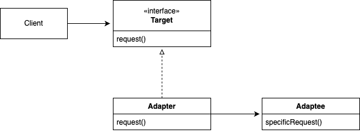
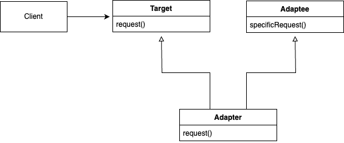
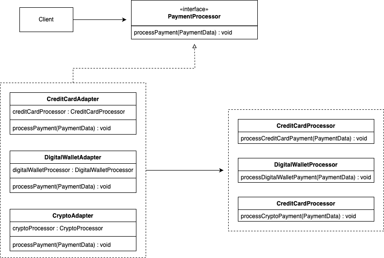

# 어댑터 패턴

## 정의

**어댑터 패턴(Adapter Pattern)** 이란, 특정 클래스 인터페이스를 클라이언트에서 요구하는 다른 인터페이스로 변환하는 역할을 하며, 서로 다른 인터페이스를 가진 클래스들이 함께 동작할 수 있도록 돕는 구조적 디자인 패턴이다.

---

## 구조

### 객체 어댑터 패턴

&nbsp;



### 클래스 어댑터 패턴

- 다중 상속 필요

&nbsp;



### Target

- 클라이언트가 사용하고자 하는 인터페이스

### Adaptee

- 어댑터 패턴에서 변환되어야 하는 기존 클래스의 역할
- Adapter를 통해 이 기능을 클라이언트가 요구하는 형태로 변환할 수 있음

### Adapter

- 호환되지 않는 Target과 Adaptee를 연결시켜주는 역할
- Target 인터페이스를 구현하며, Adaptee의 메서드를 호출함으로써 Adaptee의 기능을 Target 인터페이스를 통해 사용할 수 있도록 변환

### Client

- 어댑터 패턴을 사용하는 주체
- 필요한 서비스를 Target 인터페이스를 통해 요청

---

## 특징

### 장점

- **호환성 향상**  
  호환되지 않는 인터페이스를 가진 클래스들 사이의 호환성을 제공하여, 다양한 컴포넌트가 함께 작동할 수 있도록 돕는다.
- **재사용성 증가**  
  기존 코드를 변경하지 않고도 재사용할 수 있어 코드 베이스를 유지보수하는 데 도움이 된다.
- **확장성 증가**  
  새로운 어댑터를 추가하는 것만으로도 기존 시스템에 새로운 기능을 쉽게 통합할 수 있다.
- **결합도 감소**  
  클라이언트 코드와 기존 코드 사이의 결합도를 낮춤으로써, 시스템의 각 부분을 독립적으로 개발하고 테스트할 수 있다.

### 단점

- **코드의 복잡도 증가**  
  어댑터 클래스를 추가함으로써 전체 시스템의 구조가 복잡해질 수 있다.
- **성능 문제**  
  어댑터는 추가적인 호출을 필요로 하며, 어댑터의 사용이 많을수록 오버헤드가 누적되어 성능 저하를 초래할 수 있다.

---

## 예제

### Target

`Duck`

```java
public interface Duck {

    void quack();

    void fly();

}
```

```java
// Duck의 구현체 MallardDuck
public class MallardDuck implements Duck {

    @Override
    public void quack() {
        System.out.println("꽥");
    }

    @Override
    public void fly() {
        System.out.println("날고 있어요!");
    }

}
```

### Adaptee

`Turkey`

```java
public interface Turkey {

    void gobble();

    void fly();

}
```

```java
// Turkey의 구현체 WildTurkey
public class WildTurkey implements Turkey {

    @Override
    public void gobble() {
        System.out.println("골골");
    }

    @Override
    public void fly() {
        System.out.println("짧은 거리를 날고 있어요!");
    }

}
```

### Adapter

`TurkeyAdapter`

```java
public class TurkeyAdapter implements Duck {

    Turkey turkey;

    public TurkeyAdapter(Turkey turkey) {
        this.turkey = turkey;
    }

    @Override
    public void quack() {
        turkey.gobble();
    }

    @Override
    public void fly() {
        for (int i = 0; i < 5; i++) {
            turkey.fly();
        }
    }

}
```

### Client

```java
public class Main {

    public static void main(String[] args) {
        Duck duck = new MallardDuck();
        Turkey turkey = new WildTurkey();
        Duck turkeyAdapter = new TurkeyAdapter(turkey);

        System.out.println("----------칠면조----------");
        turkey.gobble();
        turkey.fly();

        System.out.println("----------오리----------");
        testDuck(duck);

        System.out.println("----------칠면조 어댑터----------");
        testDuck(turkeyAdapter);
    }

    static void testDuck(Duck duck) {
        duck.quack();
        duck.fly();
    }

}
```

```
----------칠면조----------
골골
짧은 거리를 날고 있어요!

----------오리----------
꽥
날고 있어요!

----------칠면조 어댑터----------
골골
짧은 거리를 날고 있어요!
짧은 거리를 날고 있어요!
짧은 거리를 날고 있어요!
짧은 거리를 날고 있어요!
짧은 거리를 날고 있어요!
```

---

## 실습

### 클래스 다이어그램

&nbsp;



### Data

`PaymentData`

```java
public record PaymentData(double amount, String currency) {

}
```

### Target

`PaymentProcessor`

```java
public interface PaymentProcessor {

    void processPayment(PaymentData paymentData);

}
```

### Adaptee

`CreditCardProcessor` / `DigitalWalletProcessor` / `CryptoProcessor`

```java
// CreditCardProcessor
public class CreditCardProcessor {

    public void processCreditCardPayment(PaymentData data) {
        System.out.println("신용카드로 결제 처리: " + data.amount() + data.currency());
    }

}

// DigitalWalletProcessor
public class DigitalWalletProcessor {

    public void processDigitalWalletPayment(PaymentData data) {
        System.out.println("전자지갑으로 결제 처리: " + data.amount() + data.currency());
    }

}

// CryptoProcessor
public class CryptoProcessor {

    public void processCryptoPayment(PaymentData data) {
        System.out.println("암호화폐로 결제 처리: " + data.amount() + data.currency());
    }

}
```

### Adapter

`CreditCardAdapter` / `DigitalWalletAdapter` / `CryptoAdapter`

```java
// CreditCardAdapter
public class CreditCardAdapter implements PaymentProcessor {

    private CreditCardProcessor creditCardProcessor;

    public CreditCardAdapter(CreditCardProcessor creditCardProcessor) {
        this.creditCardProcessor = creditCardProcessor;
    }

    @Override
    public void processPayment(PaymentData paymentData) {
        creditCardProcessor.processCreditCardPayment(paymentData);
    }

}

// DigitalWalletAdapter
public class DigitalWalletAdapter implements PaymentProcessor {

    private DigitalWalletProcessor digitalWalletProcessor;

    public DigitalWalletAdapter(DigitalWalletProcessor digitalWalletProcessor) {
        this.digitalWalletProcessor = digitalWalletProcessor;
    }

    @Override
    public void processPayment(PaymentData paymentData) {
        digitalWalletProcessor.processDigitalWalletPayment(paymentData);
    }

}

// CryptoAdapter
public class CryptoAdapter implements PaymentProcessor {

    private CryptoProcessor cryptoProcessor;

    public CryptoAdapter(CryptoProcessor cryptoProcessor) {
        this.cryptoProcessor = cryptoProcessor;
    }

    @Override
    public void processPayment(PaymentData data) {
        cryptoProcessor.processCryptoPayment(data);
    }

}
```

### Client

```java
public class Client {

    public static void main(String[] args) {
        PaymentProcessor cardProcessor = new CreditCardAdapter(new CreditCardProcessor());
        PaymentProcessor paypalProcessor = new DigitalWalletAdapter(new DigitalWalletProcessor());
        PaymentProcessor cryptoProcessor = new CryptoAdapter(new CryptoProcessor());

        PaymentData cardPayment = new PaymentData(100.00, "USD");
        PaymentData digitalWalletPayment = new PaymentData(200.00, "KRW");
        PaymentData cryptoPayment = new PaymentData(300.00, "BTC");

        cardProcessor.processPayment(cardPayment);
        paypalProcessor.processPayment(digitalWalletPayment);
        cryptoProcessor.processPayment(cryptoPayment);
    }

}
```

```
신용카드로 결제 처리: 100.0USD
전자지갑으로 결제 처리: 200.0KRW
암호화폐로 결제 처리: 300.0BTC
```
