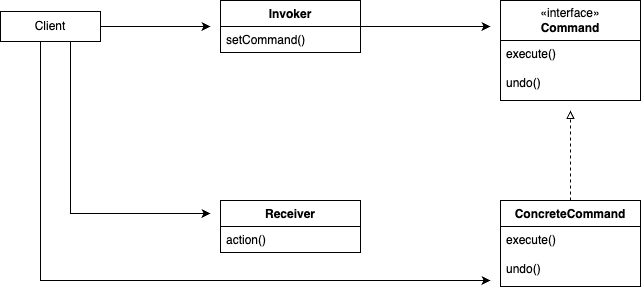
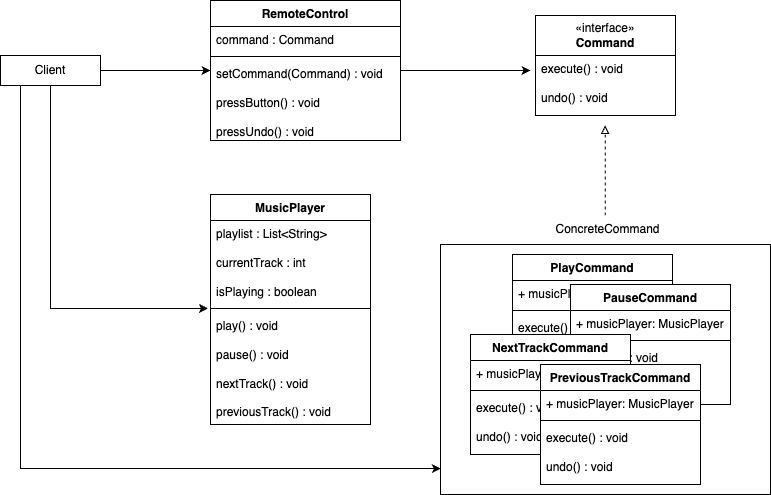

# 커맨드 패턴

## 정의

**커맨드 패턴(Command Pattern)** 이란, 요청 내역을 객체로 캡슐화해서 객체를 서로 다른 요청 내역에 따라 매개변수화할 수 있다. 요청을 큐에 저장하거나 로그로 기록하거나 작업 취소 기능을 사용할 수 있다.

---

## 구조

&nbsp;



### Command

- 커맨드 패턴의 핵심 인터페이스로, 실행할 명령의 추상화를 제공
- Receiver에게 특정 작업을 처리하라는 지시를 전달

### ConcreteCommand

- Command 인터페이스를 구현하는 구상 클래스
- 커맨드 패턴에서 실제로 작업을 수행하는 구체적인 명령을 담당
- 명령을 수행할 때 필요한 Receiver 객체를 참조하고, Command 인터페이스의 `execute` 메서드를 통해 Receiver의 메서드를 호출하여 명령을 수행

### Receiver

- ConcreteCommand에 의해 호출되는 명령의 실제 수행 주체
- 실제로 작업을 수행하는 로직을 가지고 있으며, ConcreteCommand에서는 이 Receiver를 통해 작업을 실행

### Invoker

- 명령을 실행할 때 이를 호출하는 역할을 담당
- 하나 이상의 Command 객체를 저장하고 관리할 수 있는 구조를 가지고 있으며, 사용자의 요청에 따라 적절한 Command의 메서드를 호출

### Client

- Command 객체와 Receiver 객체를 생성하고, ConcreteCommand 객체에 Receiver를 연결하는 역할
- Invoker에 Command 객체를 등록하여, Invoker가 Command를 사용할 수 있도록 설정

---

## 특징

### 장점

- **명령과 실행의 분리**  
  실행 로직을 가지는 객체와 호출 로직을 분리하여, 시스템의 결합도를 낮추고 유연성을 증가시킨다.
- **확장성**  
  OCP를 준수하며 기존 코드를 변경하지 않고 새로운 명령을 추가할 수 있어, 기능 확장이 간편하다.
- **재사용성 및 결합도 감소**  
  커맨드 객체를 재사용할 수 있으며, 클라이언트와 수행되는 작업 사이의 결합도가 낮아지기 때문에, 다양한 컨텍스트에서 동일한 커맨드를 사용할 수 있다.
- **작업의 기록 및 취소가 용이**  
  수행된 작업을 저장하고, 이력을 관리할 수 있으므로 Undo/Redo와 같은 기능 구현이 용이하다.

### 단점

- **클래스 및 객체의 증가**  
  각각의 동작을 커맨드 객체로 캡슐화해야 하므로, 시스템에 많은 커맨드 클래스가 생길 수 있어 관리가 복잡해질 수 있다.
- **구현의 복잡성**  
  간단한 동작에 대해서도 커맨드 클래스를 만들어야 하는 경우, 전체적인 구현이 과도하게 복잡해질 수 있다.
- **디자인의 어려움**  
  초기 설계에서 모든 명령을 고려하여 캡슐화하는 과정이 복잡하고, 특히 큰 시스템에서는 명령의 구분과 설계가 어려울 수 있다.

---

## 예제

### Command

`Command`

```java
public interface Command {

    public void execute();

}
```

### ConcreteCommand

`LightOnCommand` / `LightOffCommand`  
`StereoOnWithCDCommand` / `StereoOffCommand`

```java
// LightOnCommand
public class LightOnCommand implements Command {

    Light light;

    public LightOnCommand(Light light) {
        this.light = light;
    }

    @Override
    public void execute() {
        light.on();
    }

}

// LightOffCommand
public class LightOffCommand implements Command {

    Light light;

    public LightOffCommand(Light light) {
        this.light = light;
    }

    @Override
    public void execute() {
        light.off();
    }

}

// StereoOnWithCDCommand
public class StereoOnWithCDCommand implements Command {

    Stereo stereo;

    public StereoOnWithCDCommand(Stereo stereo) {
        this.stereo = stereo;
    }

    @Override
    public void execute() {
        stereo.on();
        stereo.setCD();
        stereo.setVolume(11);
    }

}

// StereoOffCommand
public class StereoOffCommand implements Command {

    Stereo stereo;

    public StereoOffCommand(Stereo stereo) {
        this.stereo = stereo;
    }

    @Override
    public void execute() {
        stereo.off();
    }

}
```

### Receiver

`Light` / `Stereo`

```java
// Light
public class Light {

    String location = "";

    public Light(String location) {
        this.location = location;
    }

    public void on() {
        System.out.println(location + " light is on");
    }

    public void off() {
        System.out.println(location + " light is off");
    }

}

// Stereo
public class Stereo {

    String location;

    public Stereo(String location) {
        this.location = location;
    }

    public void on() {
        System.out.println(location + " stereo is on");
    }

    public void off() {
        System.out.println(location + " stereo is off");
    }

    public void setCD() {
        System.out.println(location + " stereo is set for CD input");
    }

    public void setDVD() {
        System.out.println(location + " stereo is set for DVD input");
    }

    public void setRadio() {
        System.out.println(location + " stereo is set for Radio");
    }

    public void setVolume(int volume) {
        System.out.println(location + " stereo volume set to " + volume);
    }

}
```

### Invoker

`RemoteControl`

```java
public class RemoteControl {

    Command[] onCommands;
    Command[] offCommands;

    public RemoteControl() {
        onCommands = new Command[7];
        offCommands = new Command[7];

        Command noCommand = new NoCommand();
        for (int i = 0; i < 7; i++) {
            onCommands[i] = noCommand;
            offCommands[i] = noCommand;
        }
    }

    public void setCommand(int slot, Command onCommand, Command offCommand) {
        onCommands[slot] = onCommand;
        offCommands[slot] = offCommand;
    }

    public void onButtonWasPushed(int slot) {
        onCommands[slot].execute();
    }

    public void offButtonWasPushed(int slot) {
        offCommands[slot].execute();
    }

}
```

### Client

```java
public class RemoteLoader {

    public static void main(String[] args) {
        RemoteControl remoteControl = new RemoteControl();

        Light livingRoomLight = new Light("Living Room");
        Light kitchenLight = new Light("Kitchen");
        Stereo stereo = new Stereo("Living Room");

        LightOnCommand livingRoomLightOn =
                new LightOnCommand(livingRoomLight);
        LightOffCommand livingRoomLightOff =
                new LightOffCommand(livingRoomLight);
        LightOnCommand kitchenLightOn =
                new LightOnCommand(kitchenLight);
        LightOffCommand kitchenLightOff =
                new LightOffCommand(kitchenLight);
        StereoOnWithCDCommand stereoOnWithCD =
                new StereoOnWithCDCommand(stereo);
        StereoOffCommand stereoOff =
                new StereoOffCommand(stereo);

        remoteControl.setCommand(0, livingRoomLightOn, livingRoomLightOff);
        remoteControl.setCommand(1, kitchenLightOn, kitchenLightOff);
        remoteControl.setCommand(2, stereoOnWithCD, stereoOff);

        System.out.println(remoteControl);

        remoteControl.onButtonWasPushed(0);
        remoteControl.offButtonWasPushed(0);
        remoteControl.onButtonWasPushed(1);
        remoteControl.offButtonWasPushed(1);
        remoteControl.onButtonWasPushed(2);
        remoteControl.offButtonWasPushed(2);
    }

}
```

---

## 실습

### 클래스 다이어그램

&nbsp;



### Command

`Command`

```java
public interface Command {

    void execute();

    void undo();

}
```

### ConcreteCommand

`PlayCommand` / `PauseCommand`  
`PreviousTrackCommand` / `NextTrackCommand`

```java
// PlayCommand
public class PlayCommand implements Command {

    private MusicPlayer musicPlayer;

    public PlayCommand(MusicPlayer musicPlayer) {
        this.musicPlayer = musicPlayer;
    }

    @Override
    public void execute() {
        musicPlayer.play();
    }

    @Override
    public void undo() {
        musicPlayer.pause();
    }

}

// PauseCommand
public class PauseCommand implements Command {

    private MusicPlayer musicPlayer;

    public PauseCommand(MusicPlayer musicPlayer) {
        this.musicPlayer = musicPlayer;
    }

    @Override
    public void execute() {
        musicPlayer.pause();
    }

    @Override
    public void undo() {
        musicPlayer.play();
    }

}

// NextTrackCommand
public class NextTrackCommand implements Command {

    private MusicPlayer musicPlayer;

    public NextTrackCommand(MusicPlayer musicPlayer) {
        this.musicPlayer = musicPlayer;
    }

    @Override
    public void execute() {
        musicPlayer.nextTrack();
    }

    @Override
    public void undo() {
        musicPlayer.previousTrack();
    }

}

// PreviousTrackCommand
public class PreviousTrackCommand implements Command {

    private MusicPlayer musicPlayer;

    public PreviousTrackCommand(MusicPlayer musicPlayer) {
        this.musicPlayer = musicPlayer;
    }

    @Override
    public void execute() {
        musicPlayer.previousTrack();
    }

    @Override
    public void undo() {
        musicPlayer.nextTrack();
    }

}
```

### Receiver

`MusicPlayer`

```java
public class MusicPlayer {

    private List<String> playlist = new ArrayList<>();
    private int currentTrack = 0;
    private boolean isPlaying = false;

    public MusicPlayer() {
        playlist.add("카더가든 - 나무");
        playlist.add("성시경 - 거리에서");
        playlist.add("박효신 - 야생화");
        playlist.add("IU - Love wins all");
        playlist.add("QWER - 고민중독");
    }

    public void play() {
        if (!isPlaying) {
            isPlaying = true;
            System.out.println("Play >>> " + playlist.get(currentTrack));
        }
    }

    public void pause() {
        if (isPlaying) {
            isPlaying = false;
            System.out.println("Pause ||| " + playlist.get(currentTrack));
        }
    }

    public void nextTrack() {
        currentTrack = (currentTrack == playlist.size() - 1) ? 0 : currentTrack + 1;
        System.out.println("Switch to : " + playlist.get(currentTrack));
        if (isPlaying)
            play();
    }

    public void previousTrack() {
        currentTrack = (currentTrack == 0) ? playlist.size() - 1 : currentTrack - 1;
        System.out.println("Switch to : " + playlist.get(currentTrack));
        if (isPlaying)
            play();
    }

}
```

### Invoker

`RemoteControl`

```java
public class RemoteControl {

    private Command command;

    public void setCommand(Command command) {
        this.command = command;
    }

    public void pressButton() {
        command.execute();
    }

    public void pressUndo() {
        command.undo();
    }

}
```

### Client

```java
public class Main {

    public static void main(String[] args) {
        MusicPlayer musicPlayer = new MusicPlayer();

        Command playCommand = new PlayCommand(musicPlayer);
        Command pauseCommand = new PauseCommand(musicPlayer);
        Command nextTrackCommand = new NextTrackCommand(musicPlayer);
        Command previousTrackCommand = new PreviousTrackCommand(musicPlayer);

        RemoteControl remote = new RemoteControl();

        remote.setCommand(playCommand);
        remote.pressButton();
        remote.pressUndo();

        remote.setCommand(pauseCommand);
        remote.pressButton();
        remote.pressUndo();

        remote.setCommand(nextTrackCommand);
        remote.pressButton();
        remote.pressUndo();

        remote.setCommand(previousTrackCommand);
        remote.pressButton();
        remote.pressUndo();
    }

}
```

```
Play >>> 카더가든 - 나무
Pause ||| 카더가든 - 나무

Play >>> 카더가든 - 나무

Switch to : 성시경 - 거리에서
Switch to : 카더가든 - 나무

Switch to : QWER - 고민중독
Switch to : 카더가든 - 나무
```

---

## 커맨드 패턴이 유용한 사례

### 작업들로 객체를 매개변수화하려는 경우

커맨드 패턴을 사용하면 다양한 작업을 객체로 캡슐화하여, 이러한 객체들을 메서드의 인수로 전달할 수 있다. 이 방법은 동일한 작업을 수행하는 함수나 메소드를 여러 번 구현하는 대신, 작업의 실행을 객체의 인터페이스로 일반화할 수 있게 해준다.

### 작업들의 실행을 예약하거나 대기열에 넣는 경우

커맨드 패턴은 요청들을 쉽게 저장하고, 대기열에 넣거나 나중에 실행할 수 있다. 특히 작업 스케줄링, 배치 처리, 네트워크 요청, 이벤트 핸들링 시스템에서 유용하다.

### 되돌릴 수 있는 작업을 구현할 경우

커맨드 패턴은 실행 취소(undo) 기능을 구현하기에 적합하다. 편집기, GUI, 트랜잭션 처리 시스템 등에서 중요하게 사용되는 기능이며, 사용자의 오류를 용이하게 해결하거나 시스템의 이전 상태로 복구할 수 있는 유연성을 제공한다.
