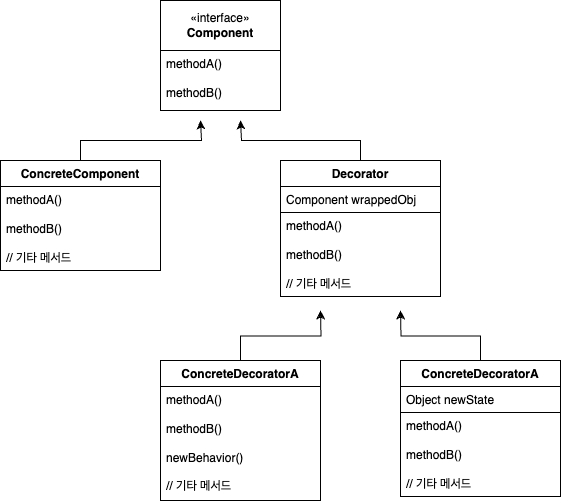
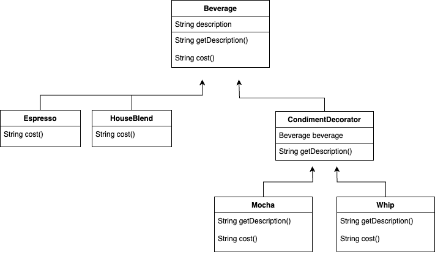
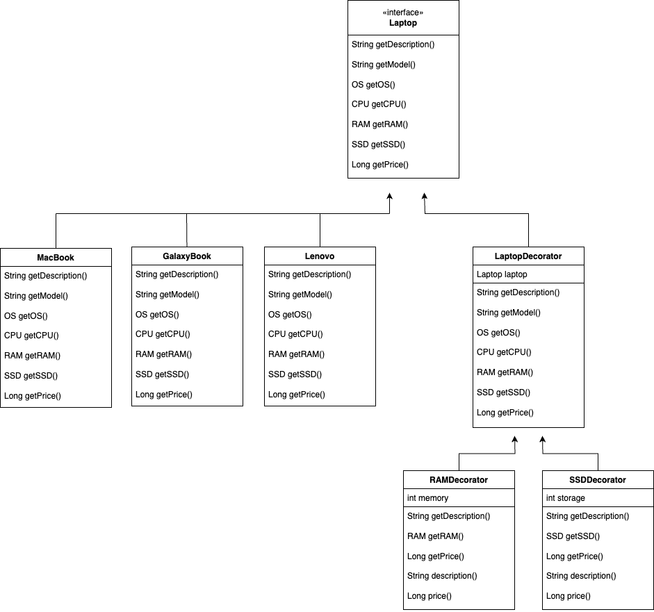
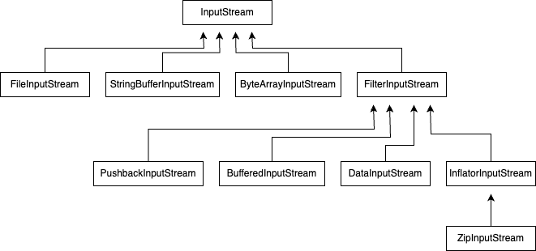

# 데코레이터 패턴

## 정의

**데코레이터 패턴(Decorator Pattern)** 이란, 객체에 추가 요소를 동적으로 더할 수 있습니다.  
데코레이터 패턴을 사용하면 서브클래스를 만들 때보다 훨씬 유연하게 기능을 확장할 수 있습니다.

---

## 구조

&nbsp;



### Component

- 데코레이터 패턴에서 가장 기본이 되는 역할
- 인터페이스 또는 추상 클래스로 시스템에서 확장 가능한 기능들을 정의
- 모든 구체 컴포넌트와 데코레이터들은 이 Component를 구현하거나 상속받아, 인터페이스 호환성을 유지하며 기능 추가가 가능

### ConcreteComponent

- Component의 기본 기능을 구현하는 클래스
- 데코레이터 패턴에서 실제로 작업을 수행하는 기본 객체
- 데코레이터를 통해 동적으로 기능을 확장

### Decorator

- Component를 구현하고, 내부에 Component 타입의 객체를 참조하는 필드가 존재
- 구체적인 기능을 구현하는 대신 Component 객체를 감싸는 래퍼 역할

### ConcreteDecorator

- Decorator를 상속받아 특정 기능을 추가하는 클래스
- 데코레이터 패턴에서 실제로 추가 기능을 구현하는 부분

---

## 특징

### 장점

- **유연한 기능 확장**  
  데코레이터 패턴은 상속 대신 구성(Composition)을 사용하여 실행 시간에 객체의 행동을 확장할 수 있는 유연성을 제공하며, 이를 통해 새로운 데코레이터를 추가하여 기능을 확장할 수 있다.
- **OCP 준수**  
  OCP(Open-Closed Principle)를 준수하며 기존 코드를 변경하지 않고도 객체의 기능을 확장할 수 있다.
- **재사용성 증가**  
  특정 기능을 구현하는 데코레이터는 다양한 컨텍스트에서 재사용될 수 있어, 코드 중복을 줄이고 재사용성을 높일 수 있다.
- **결합도 감소**  
  데코레이터를 사용함으로써, 컴포넌트의 기능 확장이 필요할 때 기존 컴포넌트의 코드 변경 없이 새로운 데코레이터 클래스를 추가하기만 하면 되므로, 클래스 간의 결합도를 낮출 수 있다.

### 단점

- **컴포넌트의 인스턴스화 과정의 복잡성 증가**  
  컴포넌트를 인스턴스화할 때 추가로 여러 데코레이터로 감싸야 하기 때문에 컴포넌트의 인스턴스화 과정이 복잡하다.
- **시스템 복잡도 증가**  
  데코레이터를 많이 사용하면 시스템이 복잡해질 수 있다. 또한 객체의 구성이 런타임에 결정되므로, 코드를 통해 바로 이해하기 어려울 수 있다.
- **디자인의 어려움**  
  데코레이터 패턴을 설계하고 구현하는 과정이 복잡하다.
- **데코레이터 추적의 어려움**  
  데코레이터 체인이 여러 계층으로 연결되어 있어 데코레이터가 다른 데코레이터를 추적하는 데 어려움이 있다.

---

## 예제

### 클래스 다이어그램

&nbsp;



### Component

`Beverage`

```java
public abstract class Beverage {

    String description = "제목 없음";

    public String getDescription() {
        return description;
    }

    public abstract double cost();

}
```

### ConcreteComponent

`Espresso` / `HouseBlend`

```java
// Espresso
public class Espresso extends Beverage {

    public Espresso() {
        description = "에스프레소";
    }

    @Override
    public double cost() {
        return 1.99;
    }

}

// HouseBlend
public class HouseBlend extends Beverage {

    public HouseBlend() {
        description = "하우스 블렌드";
    }

    @Override
    public double cost() {
        return .89;
    }

}
```

### Decorator

`CondimentDecorator`

```java
public abstract class CondimentDecorator extends Beverage {

    Beverage beverage;

    @Override
    public abstract String getDescription();

}
```

### ConcreteDecorator

`Mocha` / `Whip`

```java
// Mocha
public class Mocha extends CondimentDecorator {

    public Mocha(Beverage beverage) {
        this.beverage = beverage;
    }

    @Override
    public String getDescription() {
        return beverage.getDescription() + ", 모카";
    }

    @Override
    public double cost() {
        return beverage.cost() + .20;
    }

}

// Whip
public class Whip extends CondimentDecorator {

    public Whip(Beverage beverage) {
        this.beverage = beverage;
    }

    @Override
    public String getDescription() {
        return beverage.getDescription() + ", 휘핑크림";
    }

    @Override
    public double cost() {
        return beverage.cost() + .14;
    }

}
```

### Test

```java
public class Main {

    public static void main(String[] args) {
        Beverage beverage1 = new Espresso();
        System.out.println(beverage1.getDescription() + " $" + beverage1.cost());

        Beverage beverage2 = new HouseBlend();
        beverage2 = new Mocha(beverage2);
        beverage2 = new Whip(beverage2);
        System.out.println(beverage2.getDescription() + " $" + beverage2.cost());
    }

}
```

```
에스프레소 $1.99
하우스 블렌드, 모카, 휘핑크림 $1.23
```

---

## 실습

### 클래스 다이어그램

&nbsp;



### Laptop Components

`OS` / `CPU` / `RAM` / `SSD`

```java
// OS
public enum OS {

    WINDOWS_10, WINDOWS_11, MAC_OS, LINUX

}

// CPU
public enum CPU {

    APPLE_M1, APPLE_M2, APPLE_M3, INTEL_CORE_5, INTEL_CORE_7, AMD_RYZEN_5, AMD_RYZEN_7

}

// RAM
/**
 * @param capacity GB 단위
 */
public record RAM(int capacity) {

}

// SSD
/**
 * @param storage GB 단위
 */
public record SSD(int storage) {

}

```

### Component

`Laptop`

```java
public interface Laptop {

    String getDescription();

    String getModel();

    OS getOS();

    CPU getCPU();

    RAM getRAM();

    SSD getSSD();

    Long getPrice();

}
```

### ConcreteComponent

`MacBook` / `GalaxyBook` / `Lenovo`

```java
// MacBook
public class MacBook implements Laptop {

    @Override
    public String getDescription() {
        return "MacBook";
    }

    @Override
    public String getModel() {
        return "MacBook";
    }

    @Override
    public OS getOS() {
        return OS.MAC_OS;
    }

    @Override
    public CPU getCPU() {
        return CPU.APPLE_M3;
    }

    @Override
    public RAM getRAM() {
        return new RAM(8);
    }

    @Override
    public SSD getSSD() {
        return new SSD(512);
    }

    @Override
    public Long getPrice() {
        return 2_400_000L;
    }

}

// GalaxyBook
public class GalaxyBook implements Laptop {

    @Override
    public String getDescription() {
        return "Galaxy Book";
    }

    @Override
    public String getModel() {
        return "Galaxy Book";
    }

    @Override
    public OS getOS() {
        return OS.WINDOWS_11;
    }

    @Override
    public CPU getCPU() {
        return CPU.INTEL_CORE_7;
    }

    @Override
    public RAM getRAM() {
        return new RAM(8);
    }

    @Override
    public SSD getSSD() {
        return new SSD(512);
    }

    @Override
    public Long getPrice() {
        return 1_800_000L;
    }

}

// Lenovo
public class Lenovo implements Laptop {

    @Override
    public String getDescription() {
        return "Lenovo";
    }

    @Override
    public String getModel() {
        return "Lenovo";
    }

    @Override
    public OS getOS() {
        return OS.WINDOWS_11;
    }

    @Override
    public CPU getCPU() {
        return CPU.AMD_RYZEN_7;
    }

    @Override
    public RAM getRAM() {
        return new RAM(8);
    }

    @Override
    public SSD getSSD() {
        return new SSD(256);
    }

    @Override
    public Long getPrice() {
        return 1_000_000L;
    }

}
```

### Decorator

`LaptopDecorator`

```java
public abstract class LaptopDecorator implements Laptop {

    protected final Laptop laptop;

    public LaptopDecorator(Laptop laptop) {
        this.laptop = laptop;
    }

    @Override
    public String getDescription() {
        return laptop.getDescription();
    }

    @Override
    public String getModel() {
        return laptop.getModel();
    }

    @Override
    public OS getOS() {
        return laptop.getOS();
    }

    @Override
    public CPU getCPU() {
        return laptop.getCPU();
    }

    @Override
    public RAM getRAM() {
        return laptop.getRAM();
    }

    @Override
    public SSD getSSD() {
        return laptop.getSSD();
    }

    @Override
    public Long getPrice() {
        return laptop.getPrice();
    }

}
```

### ConcreteDecorator

`RAMDecorator` / `SSDDecorator`

```java
// RAMDecorator
public class RAMDecorator extends LaptopDecorator {

    private final int memory;

    public RAMDecorator(Laptop laptop, int memory) {
        super(laptop);
        this.memory = memory;
    }

    @Override
    public String getDescription() {
        return super.getDescription() + description();
    }

    @Override
    public RAM getRAM() {
        return new RAM(laptop.getRAM().capacity() + memory);
    }

    @Override
    public Long getPrice() {
        return super.getPrice() + price();
    }

    private String description() {
        return " | RAM " + memory + "GB 추가";
    }

    // RAM 1GB 당 40,000원
    private Long price() {
        return memory * 40_000L;
    }

}

// SSDDecorator
public class SSDDecorator extends LaptopDecorator {
    private final int storage;

    public SSDDecorator(Laptop laptop, int storage) {
        super(laptop);
        this.storage = storage;
    }

    @Override
    public String getDescription() {
        return super.getDescription() + description();
    }

    @Override
    public SSD getSSD() {
        return new SSD(super.getSSD().storage() + storage);
    }

    @Override
    public Long getPrice() {
        return super.getPrice() + price();
    }

    private String description() {
        return " | SSD " + storage + "GB 추가";
    }

    // SSD 1GB 당 1,000원
    private Long price() {
        return storage * 1_000L;
    }

}
```

### Test

```java
public class Main {

    public static void main(String[] args) {
        // Lenovo | 기본 옵션
        Laptop lenovo = new Lenovo();
        getLaptop(lenovo);

        // GalaxyBook | RAM 추가
        Laptop galaxyBook = new GalaxyBook();
        galaxyBook = new RAMDecorator(galaxyBook, 8);
        getLaptop(galaxyBook);

        // MacBook | 기본 옵션
        Laptop macBook1 = new MacBook();
        getLaptop(macBook1);

        // MacBook | RAM 추가 + SSD 추가 + SSD 추가
        Laptop macBook2 = new SSDDecorator(new SSDDecorator(new RAMDecorator(new MacBook(), 16), 256), 512);
        getLaptop(macBook2);
    }

    public static void getLaptop(Laptop laptop) {
        System.out.println("<<< Laptop >>>");
        System.out.println("Description : " + laptop.getDescription());
        System.out.println("Model : " + laptop.getModel());
        System.out.println("OS : " + laptop.getOS());
        System.out.println("CPU : " + laptop.getCPU());
        System.out.println("RAM : " + laptop.getRAM().capacity() + "GB");
        System.out.println("SSD : " + laptop.getSSD().storage() + "GB");
        System.out.println("Price : " + laptop.getPrice() + "원\n");
    }

}
```

```
<<< Laptop >>>
Description : Lenovo
Model : Lenovo
OS : WINDOWS_11
CPU : AMD_RYZEN_7
RAM : 8GB
SSD : 256GB
Price : 1000000원

<<< Laptop >>>
Description : Galaxy Book | RAM 8GB 추가
Model : Galaxy Book
OS : WINDOWS_11
CPU : INTEL_CORE_7
RAM : 16GB
SSD : 512GB
Price : 2120000원

<<< Laptop >>>
Description : MacBook
Model : MacBook
OS : MAC_OS
CPU : APPLE_M3
RAM : 8GB
SSD : 512GB
Price : 2400000원

<<< Laptop >>>
Description : MacBook | RAM 16GB 추가 | SSD 256GB 추가 | SSD 512GB 추가
Model : MacBook
OS : MAC_OS
CPU : APPLE_M3
RAM : 24GB
SSD : 1280GB
Price : 3808000원
```

---

## 데코레이터 패턴 적용 사례 (java.io)

&nbsp;



### Component

`InputStream`

데이터를 읽기 위한 기본 메서드를 정의

### ConcreteComponent

`FileInputStream` / `StringBufferInputStream` / `ByteArrayInputStream` / ...

`InputStream`을 상속받아 구체적인 데이터 소스에서 데이터를 읽는 방법을 구현

### Decorator

`FilterInputStream`

`InputStream`을 참조하는 변수를 포함하고 있으며, 추가적인 기능이나 변경된 기능을 제공하기 위한 추상 데코레이터

### ConcreteDecorator

`PushbackInputStream` / `BufferedInputStream` / `DataInputStream` / ...

`FilterInputStream`을 상속받아 구현한 구상 데코레이터
