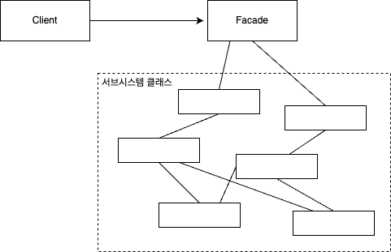
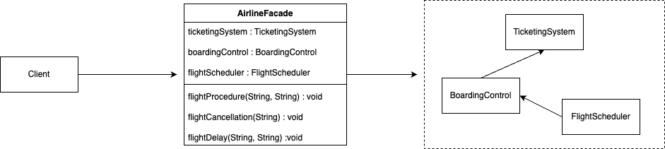

# 퍼사드 패턴

## 정의

**퍼사드 패턴(Facade Pattern)** 이란, 서브시스템에 있는 일련의 인터페이스를 통합 인터페이스로 묶어주는 역할을 한다. 또한 고수준 인터페이스도 정의하므로 서브시스템을 더 편리하게 사용할 수 있다.

---

## 구조

### 퍼사드 패턴

&nbsp;



### Facade

- 복잡한 서브시스템들에 대한 통합된 단일 인터페이스를 제공
- 클라이언트의 요청에 따라 적절한 서브시스템의 기능을 호출

### Subsystems

- Facade 뒤에 숨겨진 각각의 시스템 부분으로, Facade를 통하지 않고는 클라이언트에 직접 노출되지 않음
- Facade에 의해 조정되며, 각각 복잡한 기능과 처리 과정을 담당

### Client

- Facade를 통해 서브시스템의 기능을 사용하는 주체
- Facade가 제공하는 인터페이스를 통해 필요한 서비스를 요청

---

## 특징

### 장점

- **단순화된 인터페이스**  
  복잡한 서브시스템을 단일 인터페이스 뒤에 숨김으로써, 클라이언트가 시스템을 더 쉽게 사용할 수 있도록 제공한다.
- **결합도 감소**  
  클라이언트 코드는 서브시스템의 구체적인 구현에 의존하지 않고, 단지 퍼사드 인터페이스에만 의존하게 된다.
- **유지보수 및 확장 용이**  
  서브시스템의 변경이 있어도 퍼사드 인터페이스는 그대로 유지될 수 있다. 때문에 시스템을 업그레이드하거나 수정할 때, 클라이언트 코드에 미치는 영향을 최소화할 수 있다.

### 단점

- **퍼사드의 과도한 책임**  
  퍼사드가 서브시스템의 모든 요소를 추상화하려고 하면, 너무 많은 책임과 복잡성을 가지게 될 수 있다.
- **서브시스템에 대한 의존성**  
  퍼사드는 서브시스템에 대해 어느 정도 의존성을 가질 수밖에 없다. 만약 서브시스템이 크게 변경된다면, 퍼사드 역시 이에 맞춰 수정되어야 한다.

---

## 예제

### Subsystems

`Tuner` / `Amplifier` / `StreamingPlayer` / `Screen`  
`Projector` / `TheaterLights` / `PopcornPopper`

```java
// Tuner
public class Tuner {

    public void on() {
        // code
    }
    public void off() {
        // code
    }

}

// Amplifier
public class Amplifier {

    public void on() {
        // code
    }

    public void off() {
        // code
    }

    public void setStereoSound() {
        // code
    }

    public void setSurroundSound() {
        // code
    }

    public void setVolume(int level) {
        // code
    }

    public void setTuner(Tuner tuner) {
        // code
    }

    public void setStreamingPlayer(StreamingPlayer player) {
        // code
    }

}

// StreamingPlayer, Screen 등 Subsystems 코드 생략
```

### Facade

`HomeTheaterFacade`

```java
public class HomeTheaterFacade {

    Amplifier amp;
    Tuner tuner;
    StreamingPlayer player;
    CdPlayer cd;
    Projector projector;
    TheaterLights lights;
    Screen screen;
    PopcornPopper popper;

    public HomeTheaterFacade(Amplifier amp,
                             Tuner tuner,
                             StreamingPlayer player,
                             Projector projector,
                             Screen screen,
                             TheaterLights lights,
                             PopcornPopper popper) {

        this.amp = amp;
        this.tuner = tuner;
        this.player = player;
        this.projector = projector;
        this.screen = screen;
        this.lights = lights;
        this.popper = popper;
    }

    public void watchMovie(String movie) {
        System.out.println("Get ready to watch a movie...");
        popper.on();
        popper.pop();
        lights.dim(10);
        screen.down();
        projector.on();
        projector.wideScreenMode();
        amp.on();
        amp.setStreamingPlayer(player);
        amp.setSurroundSound();
        amp.setVolume(5);
        player.on();
        player.play(movie);
    }


    public void endMovie() {
        System.out.println("Shutting movie theater down...");
        popper.off();
        lights.on();
        screen.up();
        projector.off();
        amp.off();
        player.stop();
        player.off();
    }

    public void listenToRadio(double frequency) {
        System.out.println("Tuning in the airwaves...");
        tuner.on();
        tuner.setFrequency(frequency);
        amp.on();
        amp.setVolume(5);
        amp.setTuner(tuner);
    }

    public void endRadio() {
        System.out.println("Shutting down the tuner...");
        tuner.off();
        amp.off();
    }

}
```

### Client

```java
public class HomeTheaterTestDrive {

    public static void main(String[] args) {
        Amplifier amp = new Amplifier("Amplifier");
        Tuner tuner = new Tuner("AM/FM Tuner", amp);
        StreamingPlayer player = new StreamingPlayer("Streaming Player", amp);
        CdPlayer cd = new CdPlayer("CD Player", amp);
        Projector projector = new Projector("Projector", player);
        TheaterLights lights = new TheaterLights("Theater Ceiling Lights");
        Screen screen = new Screen("Theater Screen");
        PopcornPopper popper = new PopcornPopper("Popcorn Popper");

        HomeTheaterFacade homeTheater =
                new HomeTheaterFacade(amp, tuner, player,
                        projector, screen, lights, popper);

        homeTheater.watchMovie("Raiders of the Lost Ark");
        homeTheater.endMovie();
    }

}
```

```
Get ready to watch a movie...
Popcorn Popper on
Popcorn Popper popping popcorn!
Theater Ceiling Lights dimming to 10%
Theater Screen going down
Projector on
Projector in widescreen mode (16x9 aspect ratio)
Amplifier on
Amplifier setting Streaming player to Streaming Player
Amplifier surround sound on (5 speakers, 1 subwoofer)
Amplifier setting volume to 5
Streaming Player on
Streaming Player playing "Raiders of the Lost Ark"

Shutting movie theater down...
Popcorn Popper off
Theater Ceiling Lights on
Theater Screen going up
Projector off
Amplifier off
Streaming Player stopped "Raiders of the Lost Ark"
Streaming Player off
```

---

## 실습

### 클래스 다이어그램

&nbsp;



### Subsystems

`TicketingSystem` / `BoardingControl` / `FlightScheduler`

```java
// TicketingSystem
public class TicketingSystem {

    public boolean checkTicket(String ticketId) {
        return true;
    }

    public void cancelTicket(String ticketId) {
        System.out.println("Cancel Ticket: " + ticketId);
    }

}

// BoardingControl
public class BoardingControl {

    private TicketingSystem ticketingSystem;

    public BoardingControl(TicketingSystem ticketingSystem) {
        this.ticketingSystem = ticketingSystem;
    }

    public void processBoarding(String ticketId, int gateNumber) {
        if (ticketingSystem.checkTicket(ticketId)) {
            System.out.println("GATE NUMBER : " + gateNumber);
        } else {
            System.out.println("Invalid Ticket ID : " + ticketId);
        }
    }

}

// FlightScheduler
public class FlightScheduler {

    private BoardingControl boardingControl;

    public FlightScheduler(BoardingControl boardingControl) {
        this.boardingControl = boardingControl;
    }

    public void scheduleFlight(String ticketId, String departureTime) {
        boardingControl.processBoarding(ticketId, 5);
        System.out.println("Departure Time : " + departureTime);
    }

    public void delayFlight(String ticketId, String newDepartureTime) {
        System.out.println("Delayed to " + newDepartureTime);
    }

}
```

### Facade

`AirlineFacade`

```java
public class AirlineFacade {

    private TicketingSystem ticketingSystem;
    private BoardingControl boardingControl;
    private FlightScheduler flightScheduler;

    public AirlineFacade(TicketingSystem ticketingSystem,
                         BoardingControl boardingControl,
                         FlightScheduler flightScheduler) {
        this.ticketingSystem = ticketingSystem;
        this.boardingControl = boardingControl;
        this.flightScheduler = flightScheduler;
    }

    public void flightProcedure(String ticketId, String departureTime) {
        if (ticketingSystem.checkTicket(ticketId)) {
            System.out.println("Ticket Check Completed || " + ticketId);
            flightScheduler.scheduleFlight(ticketId, departureTime);
            System.out.println("비행 준비 절차 완료 | Ticket ID : " + ticketId);
        } else {
            System.out.println("Invalid Ticket ID: " + ticketId);
        }
    }

    public void flightCancellation(String ticketId) {
        if (ticketingSystem.checkTicket(ticketId)) {
            System.out.println("Ticket Check Completed || " + ticketId);
            ticketingSystem.cancelTicket(ticketId);
            System.out.println("비행 취소 절차 완료 | Ticket ID : " + ticketId);
        } else {
            System.out.println("Invalid Ticket ID: " + ticketId);
        }
    }

    public void flightDelay(String ticketId, String newDepartureTime) {
        if (ticketingSystem.checkTicket(ticketId)) {
            System.out.println("Ticket Check Completed || " + ticketId);
            flightScheduler.delayFlight(ticketId, newDepartureTime);
            System.out.println("비행 지연 절차 완료 | Ticket ID : " + ticketId);
        } else {
            System.out.println("Invalid Ticket ID: " + ticketId);
        }
    }

}
```

### Client

```java
public class Client {

    public static void main(String[] args) {
        TicketingSystem ticketingSystem = new TicketingSystem();
        BoardingControl boardingControl = new BoardingControl(ticketingSystem);
        FlightScheduler flightScheduler = new FlightScheduler(boardingControl);

        AirlineFacade airlineFacade = new AirlineFacade(ticketingSystem, boardingControl, flightScheduler);

        airlineFacade.flightProcedure("ABC-1234", "2024-04-10T14:00:00");
        System.out.println();
        System.out.println();


        airlineFacade.flightCancellation("ABC-1234");
        System.out.println();
        System.out.println();

        airlineFacade.flightDelay("KKL-7777", "2024-04-24T09:00:00");
    }

}
```

```
Ticket Check Completed || ABC-1234
GATE NUMBER : 5
Departure Time : 2024-04-10T14:00:00
비행 준비 절차 완료 | Ticket ID : ABC-1234


Ticket Check Completed || ABC-1234
Cancel Ticket: ABC-1234
비행 취소 절차 완료 | Ticket ID : ABC-1234


Ticket Check Completed || KKL-7777
Delayed to 2024-04-24T09:00:00
비행 지연 절차 완료 | Ticket ID : KKL-7777
```
