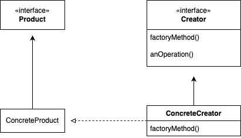
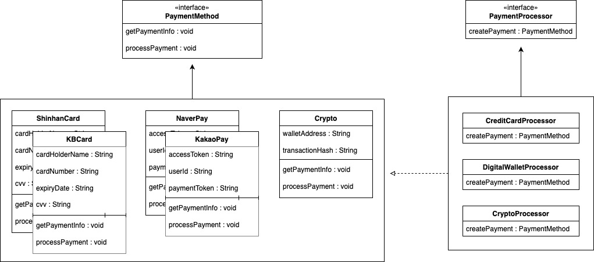
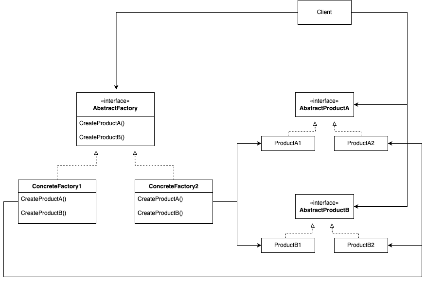
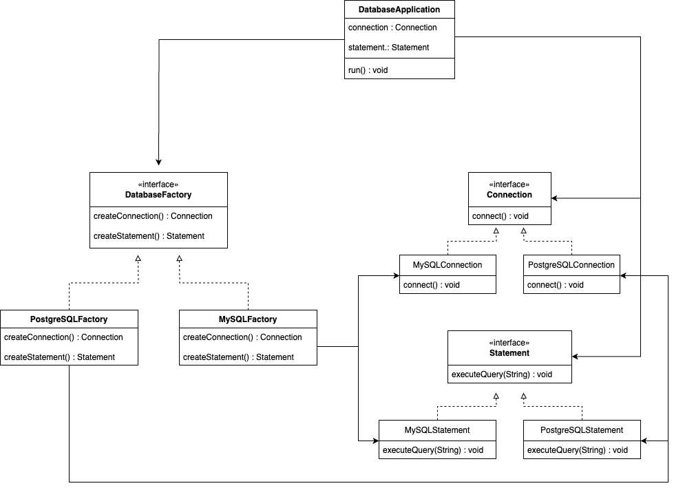

# 팩토리 메서드 패턴

## 정의

**팩토리 메서드 패턴(Factory Method Pattern)** 이란, 객체를 생성할 때 필요한 인터페이스를 정의하지만,  
인스턴스를 만들 클래스의 결정은 서브클래스가 담당하도록 하는 디자인 패턴이다.

---

## 구조

&nbsp;



### Product

- 팩토리 메서드 패턴에서 생성될 객체들을 인터페이스 또는 추상 클래스로 정의
- 모든 ConcreteProduct는 이 Product를 구현

### ConcreteProduct

- Product를 구현하는 실제 객체를 정의
- 팩토리 메서드 패턴에서 구체적으로 작업을 수행하는 기본 객체

### Creator

- Product를 만드는 팩토리 메서드를 정의하는 역할
- 추상 클래스나 인터페이스로 정의되며, 팩토리 메서드에 대한 기본 구현 제공 가능
- 팩토리 메서드는 필요한 Product를 생성하는 책임을 가지며, 생성 과정을 서브클래스에 위임

### ConcreteCreator

- Creator의 구상 클래스
- 팩토리 메서드를 오버라이딩하여 구상 Product 인스턴스를 생성
- 각 ConcreteCreator는 특정 ConcreteProduct 클래스의 인스턴스를 생성하고 반환하는 역할을 담당

---

## 특징

### 장점

- **코드 분리와 결합도 감소**  
  객체 생성 코드를 분리시켜 결합도를 감소시키고, 이를 통해 변경에 더 강한 코드를 만들 수 있다.
- **확장성 증가**  
  새로운 유형의 객체를 추가할 때, 기존 코드를 변경하지 않고, 팩토리 메서드를 오버라이드하거나 새로운 팩토리를 추가함으로써 시스템을 쉽게 확장할 수 있다.
- **OCP 준수**  
  기존의 코드를 변경하지 않고 새로운 객체 유형을 쉽게 추가할 수 있기 때문에 확장에는 열려 있고 변경에는 닫혀 있는 OCP 원칙을 준수한다.
- **캡슐화**  
  클라이언트는 어떤 서브클래스가 인스턴스화되었는지 알 필요가 없다. 팩토리 메서드가 인스턴스 생성을 캡슐화하기 때문에, 클라이언트는 단지 인터페이스를 통ㅇ해 생성된 객체를 사용한다.

### 단점

- **복잡도 증가**  
  각각의 새로운 객체 유형을 생성하기 위해 별도의 서브클래스가 필요하다. 그러므로 관리해야 할 클래스의 수가 늘어나며 시스템의 복잡도를 향상시킨다.
- **추상 설계와 구현의 어려움**  
  올바른 팩토리 메서드 설계를 위해서는 시스템의 구조와 클라이언트가 필요로 하는 객체 유형을 정확히 이해해야한다. 때문에 설계 과정이 복잡해지고 구현이 어려워질 수 있다.
- **간접적인 코드 흐름**  
  객체 생성이 간접적으로 이루어지기 때문에, 코드의 흐름을 추적하고 디버깅하기 어려울 수 있다.

---

## 예제

### Product

`Pizza`

```java
public abstract class Pizza {

    protected String name;
    protected String dough;
    protected String sauce;
    protected List<String> toppings = new ArrayList<>();

    void prepare() {
        System.out.println("준비 중 : " + name);
        System.out.println("도우 굽는 중 ...");
        System.out.println("소스 추가 중 ...");
        System.out.println("토핑 추가 : ");
        for (String topping : toppings) {
            System.out.println("   " + topping);
        }
    }

    void bake() {
        System.out.println("25분간 350도에서 굽기");
    }

    void cut() {
        System.out.println("대각선으로 컷팅");
    }

    void box() {
        System.out.println("박스에 피자 담기");
    }

    public String getName() {
        return name;
    }

}
```

### ConcreteProduct

`NYStyleCheesePizza` / `NYStylePepperoniPizza`  
`ChicagoStyleCheesePizza` / `ChicagoStylePepperoniPizza`

```java
// NYStyleCheesePizza
public class NYStyleCheesePizza extends Pizza {

    public NYStyleCheesePizza() {
        name = "뉴욕 스타일 치즈 피자";
        dough = "얇은 크러스트 도우";
        sauce = "마리나라 소스";

        toppings.add("레지아노 치즈");
    }

}

// NYStylePepperoniPizza
public class NYStylePepperoniPizza extends Pizza {

    public NYStylePepperoniPizza() {
        name = "뉴욕 스타일 페퍼로니 피자";
        dough = "얇은 크러스트 도";
        sauce = "마리나라 소스";

        toppings.add("레지아노 치즈");
        toppings.add("얇은 페퍼로니");
        toppings.add("마늘");
        toppings.add("양파");
        toppings.add("버섯");
    }

}

// ChicagoStyleCheesePizza
public class ChicagoStyleCheesePizza extends Pizza {

    public ChicagoStyleCheesePizza() {
        name = "시카고 스타일 치즈 피자";
        dough = "두꺼운 크러스트 도우";
        sauce = "토마토 소스";

        toppings.add("모짜렐라 치즈");
    }

    @Override
    void cut() {
        System.out.println("사각형으로 컷팅");
    }

}

// ChicagoStylePepperoniPizza
public class ChicagoStylePepperoniPizza extends Pizza {

    public ChicagoStylePepperoniPizza() {
        name = "시카고 스타일 페퍼로니 피자";
        dough = "두꺼운 크러스트 도우";
        sauce = "토마토 소스";

        toppings.add("모짜렐라 치즈");
        toppings.add("블랙 올리브");
        toppings.add("스피나치");
        toppings.add("페퍼로니");
    }

    @Override
    void cut() {
        System.out.println("사각형으로 컷팅");
    }

}

```

### Creator

`PizzaStore`

```java
public abstract class PizzaStore {

    public abstract Pizza createPizza(String type);

    public Pizza orderPizza(String type) {
        Pizza pizza;

        pizza = createPizza(type);

        pizza.prepare();
        pizza.bake();
        pizza.cut();
        pizza.box();

        return pizza;
    }

}
```

### ConcreteCreator

`NYPizzaStore` / `ChicagoPizzaStore`

```java
// NYPizzaStore
public class NYPizzaStore extends PizzaStore {

    @Override
    public Pizza createPizza(String type) {
        if (type.equals("cheese")) {
            return new NYStyleCheesePizza();
        } else if (type.equals("pepperoni")) {
            return new NYStylePepperoniPizza();
        } else return null;
    }

}

// ChicagoPizzaStore
public class ChicagoPizzaStore extends PizzaStore {

    @Override
    public Pizza createPizza(String type) {
        if (type.equals("cheese")) {
            return new ChicagoStyleCheesePizza();
        } else if (type.equals("pepperoni")) {
            return new ChicagoStylePepperoniPizza();
        } else return null;
    }

}
```

### Test

```java
public class Main {

    public static void main(String[] args) {
        PizzaStore nyStore = new NYPizzaStore();
        PizzaStore chicagoStore = new ChicagoPizzaStore();

        Pizza pizza = nyStore.orderPizza("cheese");
        System.out.println("오영이 주문한 피자 : " + pizza.getName());

        System.out.println();
        System.out.println("=============================");
        System.out.println();

        pizza = chicagoStore.orderPizza("pepperoni");
        System.out.println("찬희가 주문한 피자 : " + pizza.getName());
    }

}
```

```
준비 중 : 뉴욕 스타일 치즈 피자
도우 굽는 중 ...
소스 추가 중 ...
토핑 추가 :
   레지아노 치즈
25분간 350도에서 굽기
대각선으로 컷팅
박스에 피자 담기
오영이 주문한 피자 : 뉴욕 스타일 치즈 피자

==========================================

준비 중 : 시카고 스타일 페퍼로니 피자
도우 굽는 중 ...
소스 추가 중 ...
토핑 추가 :
   모짜렐라 치즈
   블랙 올리브
   스피나치
   페퍼로니
25분간 350도에서 굽기
사각형으로 컷팅
박스에 피자 담기
찬희가 주문한 피자 : 시카고 스타일 페퍼로니 피자
```

---

## 실습

### 클래스 다이어그램

&nbsp;



### Product

`PaymentMethod`

```java
public interface PaymentMethod {

    void getPaymentInfo();

    void processPayment(double amount);

}
```

### ConcreteProduct

`ShinhanCard` / `KBCard` / `NaverPay` / `KakaoPay` / `Crypto`

```java
// ShinhanCard
public class ShinhanCard implements PaymentMethod {

    private String cardHolderName;
    private String cardNumber;
    private String expiryDate;
    private String cvv;

    public ShinhanCard(String cardHolderName, String cardNumber, String expiryDate, String cvv) {
        this.cardHolderName = cardHolderName;
        this.cardNumber = cardNumber;
        this.expiryDate = expiryDate;
        this.cvv = cvv;
    }

    @Override
    public void getPaymentInfo() {
        System.out.println("Name : " + cardHolderName);
        System.out.println("Card Number : " + cardNumber);
        System.out.println("Expiry Date : " + expiryDate);
        System.out.println("CVV : " + cvv);
    }

    @Override
    public void processPayment(double amount) {
        System.out.println("신한카드 결제 : " + amount + "원\n");
    }

}
// KBCard
public class KBCard implements PaymentMethod {

    private String cardHolderName;
    private String cardNumber;
    private String expiryDate;
    private String cvv;

    public KBCard(String cardHolderName, String cardNumber, String expiryDate, String cvv) {
        this.cardHolderName = cardHolderName;
        this.cardNumber = cardNumber;
        this.expiryDate = expiryDate;
        this.cvv = cvv;
    }

    @Override
    public void getPaymentInfo() {
        System.out.println("Name : " + cardHolderName);
        System.out.println("Card Number : " + cardNumber);
        System.out.println("Expiry Date : " + expiryDate);
        System.out.println("CVV : " + cvv);
    }

    @Override
    public void processPayment(double amount) {
        System.out.println("국민카드 결제 : " + amount + "원\n");
    }

}

// NaverPay
public class NaverPay implements PaymentMethod {

    private String accessToken;
    private String userId;
    private String paymentToken;

    public NaverPay(String accessToken, String userId, String paymentToken) {
        this.accessToken = accessToken;
        this.userId = userId;
        this.paymentToken = paymentToken;
    }

    @Override
    public void getPaymentInfo() {
        System.out.println("Access Token : " + accessToken);
        System.out.println("User ID : " + userId);
        System.out.println("Payment Token : " + paymentToken);
    }

    @Override
    public void processPayment(double amount) {
        System.out.println("네이버페이 결제 : " + amount + "원\n");
    }

}
// KakaoPay
public class KakaoPay implements PaymentMethod {

    private String accessToken;
    private String userId;
    private String paymentToken;

    public KakaoPay(String accessToken, String userId, String paymentToken) {
        this.accessToken = accessToken;
        this.userId = userId;
        this.paymentToken = paymentToken;
    }

    @Override
    public void getPaymentInfo() {
        System.out.println("Access Token : " + accessToken);
        System.out.println("User ID : " + userId);
        System.out.println("Payment Token : " + paymentToken);
    }

    @Override
    public void processPayment(double amount) {
        System.out.println("카카오페이 결제 : " + amount + "원\n");
    }

}

// Crypto
public class Crypto implements PaymentMethod {

    private String walletAddress;
    private String transactionHash;

    public Crypto(String walletAddress, String transactionHash) {
        this.walletAddress = walletAddress;
        this.transactionHash = transactionHash;
    }

    @Override
    public void getPaymentInfo() {
        System.out.println("Wallet Address : " + walletAddress);
        System.out.println("Hash Code : " + transactionHash);
    }

    @Override
    public void processPayment(double amount) {
        System.out.println("비트코인 결제 : " + amount + "BTC\n");
    }

}

```

### Creator

`PaymentProcessor`

```java
public interface PaymentProcessor {

    // 신용카드용 메서드
    default PaymentMethod createPaymentMethod(String type, String cardHolderName, String cardNumber, String expiryDate, String cvv) {
        throw new UnsupportedOperationException("지원할 수 없습니다.");
    }

    // 디지털 지갑용 메서드
    default PaymentMethod createPaymentMethod(String type, String accessToken, String userId, String paymentToken) {
        throw new UnsupportedOperationException("지원할 수 없습니다.");
    }

    // 암호화폐용 메서드
    default PaymentMethod createPaymentMethod(String walletAddress, String transactionHash) {
        throw new UnsupportedOperationException("지원할 수 없습니다.");
    }

}
```

### ConcreteCreator

`CreditCardProcessor` / `DigitalWalletProcessor` / `CryptoProcessor`

```java
// CreditCardProcessor
public class CreditCardProcessor implements PaymentProcessor {

    @Override
    public PaymentMethod createPaymentMethod(String type, String cardHolderName, String cardNumber, String expiryDate, String cvv) {
        return switch (type) {
            case "Shinhan" -> new ShinhanCard(cardHolderName, cardNumber, expiryDate, cvv);
            case "KB" -> new KBCard(cardHolderName, cardNumber, expiryDate, cvv);
            default -> throw new IllegalArgumentException("지원하지 않는 신용카드 : " + type);
        };
    }

}
// DigitalWalletProcessor
public class DigitalWalletProcessor implements PaymentProcessor {

    @Override
    public PaymentMethod createPaymentMethod(String type, String accessToken, String userId, String paymentToken) {
        return switch (type) {
            case "Kakao" -> new KakaoPay(accessToken, userId, paymentToken);
            case "Naver" -> new NaverPay(accessToken, userId, paymentToken);
            default -> throw new IllegalArgumentException("지원하지 않는 전자결제 : " + type);
        };
    }

}
// CryptoProcessor
public class CryptoProcessor implements PaymentProcessor {

    @Override
    public PaymentMethod createPaymentMethod(String walletAddress, String transactionHash) {
        return new Crypto(walletAddress, transactionHash);
    }

}
```

### Test

```java
public class Main {

    public static void main(String[] args) {
        PaymentProcessor creditCardProcessor = new CreditCardProcessor();
        PaymentProcessor digitalWalletProcessor = new DigitalWalletProcessor();
        PaymentProcessor cryptoProcessor = new CryptoProcessor();

        PaymentMethod shinhanCard = creditCardProcessor.createPaymentMethod("Shinhan", "권오영", "5050-5050-5050-5050", "02/27", "999");
        PaymentMethod kbCard = creditCardProcessor.createPaymentMethod("KB", "이찬희", "1234-1234-1234-1234", "12/25", "789");

        PaymentMethod naverPay = digitalWalletProcessor.createPaymentMethod("Naver", UUID.randomUUID().toString(), "USERID_A", UUID.randomUUID().toString());
        PaymentMethod kakaoPay = digitalWalletProcessor.createPaymentMethod("Kakao", UUID.randomUUID().toString(), "USERID_B", UUID.randomUUID().toString());

        PaymentMethod crypto = cryptoProcessor.createPaymentMethod(UUID.randomUUID().toString(), "#####HASH#####");

        shinhanCard.getPaymentInfo();
        shinhanCard.processPayment(50_000);

        kbCard.getPaymentInfo();
        kbCard.processPayment(100_000);

        naverPay.getPaymentInfo();
        naverPay.processPayment(200_000);

        kakaoPay.getPaymentInfo();
        kakaoPay.processPayment(1_000_000);

        crypto.getPaymentInfo();
        crypto.processPayment(0.026);
    }

}
```

```
Name : 권오영
Card Number : 5050-5050-5050-5050
Expiry Date : 02/27
CVV : 999
신한카드 결제 : 50000.0원

Name : 이찬희
Card Number : 1234-1234-1234-1234
Expiry Date : 12/25
CVV : 789
국민카드 결제 : 100000.0원

Access Token : 65b2b5d6-caca-4788-bd41-06c2d757e223
User ID : USERID_A
Payment Token : 5a1bb0ac-86c7-4b96-8c3a-d1c4672fafe4
네이버페이 결제 : 200000.0원

Access Token : adeb6367-aaf3-4692-88e7-7a0b8967e104
User ID : USERID_B
Payment Token : 6d50f644-d436-45a1-84aa-b7e01434d0a1
카카오페이 결제 : 1000000.0원

Wallet Address : 36ae554e-e078-4b0b-abc9-573eb939fdbf
Hash Code : #####HASH#####
비트코인 결제 : 0.026BTC
```

---

# 추상 팩토리 패턴

## 정의

**추상 팩토리 패턴(Abstract Factory Pattern)** 이란, 구상 클래스에 의존하지 않고도 서로 연관되거나 의존적인 객체로 이루어진 제품군을 생산하는 인터페이스를 제공한다.

---

## 구조

&nbsp;



### AbstractFactory

- 모든 구상 팩토리에서 구현해야 하는 인터페이스
- 제품을 생산할 때 일련의 메서드를 정의
- 클라이언트가 구체적인 팩토리에 의존하지 않고 인터페이스를 의존하도록 함

### ConcreteFactory

- AbstractFactory 인터페이스를 구현하는 클래스
- 특정 제품군을 실제로 생성하는 메서드를 구현

### AbstractProduct

- 생성될 제품군의 일반적인 특성과 행위를 정의하는 인터페이스
- 특정 제품군에 속한 객체들이 가져야 할 인터페이스를 정의

### Product

- AbstractProduct를 구현하는 구상 클래스
- 실제 제품에 대한 구현을 제공

## 특징

### 장점

- **제품의 일관성 유지**
  추상 팩토리는 한 번에 하나의 제품만을 생성하도록 보장하기 때문에, 서로 호환되지 않는 객체들이 혼합되는 것을 방지할 수 있다.
- **클라이언트 코드의 격리**
  클라이언트 코드는 구체적인 제품 클래스에 의존하지 않는다. 팩토리가 객체 생성을 책임지므로, 클라이언트는 생성된 객체의 인터페이스만을 의존한다.
- **확장성 증가**
  새로운 유형의 제품군을 시스템에 추가하려면 해당 제품군을 생성할 수 있는 새로운 구체 팩토리를 추가하기만 하면 된다.
- **OCP 준수**
  기존 코드를 변경하지 않고도 새로운 제품군을 추가할 수 있게 해줌으로써 확장에는 열려 있고 변경에는 닫혀 있는 OCP를 준수한다.

### 단점

- **복잡도 증가**
  여러 제품군을 처리하기 위해 별도의 구체 팩토리가 필요하므로 관리해야 할 클래스의 수가 늘어나기 때문에 전체적인 시스템의 복잡도를 증가시킨다.
- **구체적인 제품 생성에 대한 유연성 부족**
  특정 제품군을 생성하는 데 초점을 맞추기 때문에, 하나의 제품군 내에서 어떤 구체적인 제품을 생성할지 선택하는 데는 유연성이 부족할 수 있다.
- **추상 설계와 구현의 어려움**
  추상 팩토리 패턴을 올바르게 설계하고 구현하기 위해서는 시스템의 전체 구조를 잘 이해해야한다. 때문에 설계와 구현에 어려움이 있다.
- **간접적인 코드 흐름**
  제품의 생성과 사용이 여러 단계에 걸쳐 간접적으로 이루어지므로, 코드의 흐름을 추적하고 디버깅하기 어려울 수 있다.

---

## 예제

### 클래스 다이어그램

### AbstractFactory

`PizzaIngredientFactory`

```java
public interface PizzaIngredientFactory {

    public Dough createDough();

    public Sauce createSauce();

    public Cheese createCheese();

    public Veggies[] createVeggies();

    public Pepperoni createPepperoni();

    public Clams createClam();

}
```

### ConcreteFactory

`NYPizzaIngredientFactory` / `ChicagoPizzaIngredientFactory`

```java
// NYPizzaIngredientFactory
public class NYPizzaIngredientFactory implements PizzaIngredientFactory {

    public Dough createDough() {
        return new ThinCrustDough();
    }

    public Sauce createSauce() {
        return new MarinaraSauce();
    }

    public Cheese createCheese() {
        return new ReggianoCheese();
    }

    public Veggies[] createVeggies() {
        Veggies veggies[] = {new Garlic(), new Onion(), new Mushroom(), new RedPepper()};
        return veggies;
    }

    public Pepperoni createPepperoni() {
        return new SlicedPepperoni();
    }

    public Clams createClam() {
        return new FreshClams();
    }

}

// ChicagoPizzaIngredientFactory
public class ChicagoPizzaIngredientFactory implements PizzaIngredientFactory {

	public Dough createDough() {
		return new ThickCrustDough();
	}

	public Sauce createSauce() {
		return new PlumTomatoSauce();
	}

	public Cheese createCheese() {
		return new MozzarellaCheese();
	}

	public Veggies[] createVeggies() {
		Veggies veggies[] = {new BlackOlives(), new Spinach(), new Eggplant()};
		return veggies;
	}

	public Pepperoni createPepperoni() {
		return new SlicedPepperoni();
	}

	public Clams createClam() {
		return new FrozenClams();
	}

}
```

### AbstractProduct

`Dough` / `Sauce` / `Cheese` / `Clams`

```java
// Dough
public interface Dough {

    public String toString();

}

// Sauce
public interface Sauce {

    public String toString();

}

// Cheese
public interface Cheese {

    public String toString();

}


// Clams
public interface Clams {

    public String toString();

}
```

### Product

`ThickCrustDough` / `ThinCrustDough`  
`PlumTomatoSauce` / `MarinaraSauce`  
`MozzarellaCheese` / `ReggianoCheese`  
`FrozenClams` / `FreshClams`

```java
// ThickCrustDough & ThinCrustDough
public class ThickCrustDough implements Dough {

    public String toString() {
        return "ThickCrust style extra thick crust dough";
    }

}

public class ThinCrustDough implements Dough {

    public String toString() {
        return "Thin Crust Dough";
    }

}

// PlumTomatoSauce & MarinaraSauce
public class PlumTomatoSauce implements Sauce {

    public String toString() {
        return "Tomato sauce with plum tomatoes";
    }

}

public class MarinaraSauce implements Sauce {

    public String toString() {
        return "Marinara Sauce";
    }

}

// MozzarellaCheese & ReggianoCheese
public class MozzarellaCheese implements Cheese {

    public String toString() {
	    return "Shredded Mozzarella";
    }

}

public class ReggianoCheese implements Cheese {

    public String toString() {
    	return "Reggiano Cheese";
    }

}

// FrozenClams & FreshClams
public class FrozenClams implements Clams {

    public String toString() {
    	return "Frozen Clams from Chesapeake Bay";
    }

}

public class FreshClams implements Clams {

    public String toString() {
    	return "Fresh Clams from Long Island Sound";
    }

}
```

---

## 실습

### 클래스 다이어그램

&nbsp;



### AbstractFactory

`DatabaseFactory`

```java
public interface DatabaseFactory {

    Connection createConnection();

    Statement createStatement();

}
```

### ConcreteFactory

`MySQLFactory` / `PostgreSQLFactory`

```java
// MySQLFactory
public class MySQLFactory implements DatabaseFactory {

    @Override
    public Connection createConnection() {
        return new MySQLConnection();
    }

    @Override
    public Statement createStatement() {
        return new MySQLStatement();
    }

}

// PostgreSQLFactory
public class PostgreSQLFactory implements DatabaseFactory {

    @Override
    public Connection createConnection() {
        return new PostgreSQLConnection();
    }

    @Override
    public Statement createStatement() {
        return new PostgreSQLStatement();
    }

}
```

### AbstractProduct

`Connection` / `Statement`

```java
// Connection
public interface Connection {

    void connect();

}
// Statement
public interface Statement {

    void executeQuery(String query);

}
```

### Product

`MySQLConnection` / `MySQLStatement`  
`PostgreSQLConnection` / `PostgreSQLStatement`

```java
// MySQLConnection
public class MySQLConnection implements Connection {

    @Override
    public void connect() {
        System.out.println("Connect -------> MySQL");
    }

}

// MySQLStatement
public class MySQLStatement implements Statement {

    @Override
    public void executeQuery(String query) {
        System.out.println("----- Executing MySQL Query -----");
        System.out.println(query);
    }

}

// PostgreSQLConnection
public class PostgreSQLConnection implements Connection {

    @Override
    public void connect() {
        System.out.println("Connect -------> PostgreSQL");
    }

}

// PostgreSQLStatement
public class PostgreSQLStatement implements Statement {

    @Override
    public void executeQuery(String query) {
        System.out.println("----- Executing PostgreSQL Query -----");
        System.out.println(query);
    }

}
```

### Client

```java
public class DatabaseApplication {

    private Connection connection;
    private Statement statement;

    public DatabaseApplication(DatabaseFactory databaseFactory) {
        connection = databaseFactory.createConnection();
        statement = databaseFactory.createStatement();
    }

    public void run() {
        connection.connect();
        statement.executeQuery("SELECT * FROM members");
    }

}
```

### Test

```java
public class Main {

    public static void main(String[] args) {
        DatabaseFactory mySQLFactory = new MySQLFactory();
        DatabaseFactory postgreSQLFactory = new PostgreSQLFactory();

        DatabaseApplication mySQLDatabaseApp = new DatabaseApplication(mySQLFactory);
        DatabaseApplication postgreSQLDatabaseApp = new DatabaseApplication(postgreSQLFactory);

        mySQLDatabaseApp.run();

        postgreSQLDatabaseApp.run();
    }

}
```

```
Connect -------> MySQL
----- Executing MySQL Query -----
SELECT * FROM members

Connect -------> PostgreSQL
----- Executing PostgreSQL Query -----
SELECT * FROM members
```

---

## 팩토리 메서드 패턴 VS 추상 팩토리 패턴

| 구분               | **팩토리 메서드** 패턴                                                                  | **추상 팩토리 패턴**                                                                                           |
| ------------------ | --------------------------------------------------------------------------------------- | -------------------------------------------------------------------------------------------------------------- |
| **목적**           | 하나의 제품을 생성하고, 생성할 객체의 클래스 선택은 서브클래스가 담당                   | 서로 관련된 여러 제품군을 일관되게 생성하기 위한 인터페이스를 제공                                             |
| **사용 시점**      | 클라이언트는 인터페이스를 통해 생성 요청을 하며, 구체적인 객체 생성은 서브클래스가 결정 | 클라이언트는 추상 팩토리 인터페이스를 통해 제품군을 생성하며, 구체적인 팩토리 클래스가 제품의 세부 구현을 담당 |
| **확장성 및 변경** | 제품을 추가하기 위해서는 새로운 Creator 서브클래스를 생성                               | 새로운 제품군을 추가하거나 변경하기 위해서는 팩토리 인터페이스와 모든 구현 클래스를 수정                       |
