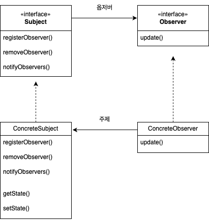

# 옵저버 패턴

## 정의

**옵저버 패턴(Observer Pattern)**이란, 객체간의 일대다 종속성을 정의하고 어떤 객체의 상태가 변경될 때 그 객체에 종속된 모든 객체들이 자동으로 알림을 받고 갱신되도록 하는 패턴이다.

---

## 구조

&nbsp;

### Subject

- 옵저버 패턴에서 이벤트를 생성하는 핵심 역할을 하는 객체
- 인터페이스 또는 추상 클래스로서, 시스템에서 발생하는 중요한 변화를 감지하고 이를 옵저버들에게 알리는 주제로서 메커니즘을 정의

### ConcreteSubject

- Subject를 구현한 구상 클래스
- 옵저버 패턴에서 실제로 상태 변화를 감지하고, 그 변화를 옵저버들에게 전달하는 기본 객체
- 옵저버들을 관리하는 기능도 수행

### Observer

- Subject의 상태 변화에 반응하는 객체들의 인터페이스
- 상태 변화에 따라 독립적으로 업데이트되는 메서드를 포함

### ConcreteObserver

- Observer 인터페이스를 구현하고, Subject로부터의 상태 변화를 전달받는 구상 클래스
- 각 옵저버는 특정 주제에 등록되어 연락받을 수 있음

---

## 특징

### 장점

- **분리와 재사용성 증가**  
  주제와 옵저버를 분리하며 각각 재사용할 수 있게 한다. 때문에 컴포넌트의 결합도가 낮아지고 유지보수가 용이하다.
- **동적인 구독 관리**  
  옵저버 패턴을 사용하면 실행 중에 옵저버를 동적으로 추가하거나 제거할 수 있다.
- **이벤트 기반 프로그래밍**  
  애플리케이션에서 발생하는 다양한 이벤트를 효과적으로 처리할 수 있도록 돕는다.
- **OCP 준수**  
  주제의 코드를 수정하지 않고도 새로운 옵저버를 추가할 수 있으므로 OCP를 준수한다.

### 단점

- **옵저버의 갱신 처리**  
  주제의 상태가 빈번하게 변할 경우, 등록된 모든 옵저버들이 갱신을 받기 때문에 시스템의 성능에 부담을 줄 수 있다.
- **옵저버 간의 업데이트 순서**  
  옵저버들의 알림 순서에 의존하지 않도록 하는 것이 좋다. 옵저버들이 특정 순서에 의존하면, 각 옵저버의 구현이 다른 옵저버들의 동작 순서를 예상하고 그에 맞춰져 있어야하므로 결합도가 증가하고, 확장성이 저하된다.

---

## 예제

---

## 실습

&nbsp;
