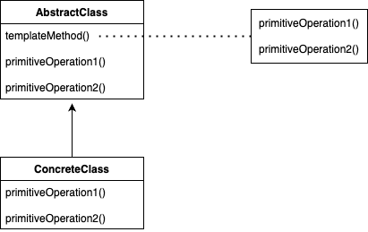
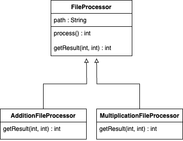

# 템플릿 메소드 패턴

## 정의

**템플릿 메소드 패턴(Template Method Pattern)** 은 알고리즘의 골격을 정의한다. 알고리즘의 일부 단계를 서브클래스에서 구현할 수 있으며, 알고리즘의 구조는 그대로 유지하며 알고리즘의 특정 단계를 서브클래스에서 재정의할 수 있다.

---

## 구조

&nbsp;



### AbstractClass

- 템플릿 메소드를 정의하고 알고리즘의 구조를 제공하는 역할
- 템플릿 메소드 내에서 알고리즘의 일부 단계를 구현하거나, 구현을 추상 메소드로 선언하여 하위 클래스에게 위임할 수 있음

### ConcreteClass

- AbstractClass를 상속받아서 템플릿 메소드의 구체적인 단계를 구현하는 역할
- AbstractClass에서 정의된 추상 메소드를 구현하여 알고리즘의 특정 단계를 구체화

### Client

- AbstractClass에서 제공하는 템플릿 메소드를 활용하여 알고리즘을 실행하는 역할

---

## 특징

### 장점

- **코드의 재사용성**  
  알고리즘의 구조를 슈퍼클래스에 정의하므로, 코드 중복을 줄이고 유지보수성을 향상시킨다.
- **유연성 증가**  
  알고리즘의 일부분을 서브클래스에서 구현하므로, 새로운 알고리즘을 추가하거나 기존 알고리즘을 변경할 때 변경의 영향을 최소화한다.
- **확장성 증가**  
  AbstractClass를 통해 알고리즘의 구조를 정의하므로, 새로운 ConcreteClass를 추가하여 다양한 알고리즘을 확장할 수 있다.

### 단점

- **LSP 원칙 위반 가능성**  
  템플릿 메서드의 일부 단계를 오버라이드하는 서브클래스가 슈퍼클래스의 추상 메서드를 제대로 구현하지 않거나 잘못된 동작을 수행하는 경우 LSP 원칙을 위반할 수 있다.
- **복잡도 증가**  
  알고리즘의 구조가 복잡할수록 템플릿을 유지하기 어려워진다.

---

## 예제

### AbstractClass

`CaffeineBeverage`

```java
public abstract class CaffeineBeverage {

    final void prepareRecipe() {
        boilWater();
        brew();
        pourInCup();
        addCondiments();
    }

    abstract void brew();

    abstract void addCondiments();

    void boilWater() {
        System.out.println("물을 끓인다.");
    }

    void pourInCup() {
        System.out.println("컵에 따른다.");
    }

}
```

### ConcreteClass

`Coffee` / `Tea`

```java
// Coffee
public class Coffee extends CaffeineBeverage {

    public void brew() {
        System.out.println("커피를 우려낸다.");
    }

    public void addCondiments() {
        System.out.println("설탕과 우유를 추가한다.");
    }

}

// Tea
public class Tea extends CaffeineBeverage {

    public void brew() {
        System.out.println("차를 우려낸다.");
    }

    public void addCondiments() {
        System.out.println("레몬을 추가한다.");
    }

}
```

### Client

```java
public class Client {

    public static void main(String[] args) {
        Coffee coffee = new Coffee();
        Tea tea = new Tea();

        coffee.prepareRecipe();
        tea.prepareRecipe();
    }

}

```

```
물을 끓인다.
커피를 우려낸다.
컵에 따른다.
설탕과 우유를 추가한다.

물을 끓인다.
차를 우려낸다.
컵에 따른다.
레몬을 추가한다.
```

---

## 실습

### 클래스 다이어그램

&nbsp;



### File

`number.txt`

```
1
2
3
4
5
```

### AbastractClass

`FileProcessor`

```java
public abstract class FileProcessor {

    private String path;

    public FileProcessor(String path) {
        this.path = path;
    }

    public final int process() {
        try (BufferedReader reader = new BufferedReader(new FileReader(path))) {
            int result = 0;
            String line = null;
            while ((line = reader.readLine()) != null) {
                result = getResult(result, Integer.parseInt(line));
            }
            return result;
        } catch (IOException e) {
            throw new IllegalArgumentException(path + "에 해당하는 파일이 없습니다.", e);
        }
    }

    protected abstract int getResult(int result, int number);

}
```

### ConcreteClass

`AdditionFileProcessor` / `MultiplicationFileProcessor`

```java
// AdditionFileProcessor
public class AdditionFileProcessor extends FileProcessor {

    public AdditionFileProcessor(String path) {
        super(path);
    }

    @Override
    public int getResult(int result, int number) {
        return result += number;
    }

}

// MultiplicationFileProcessor
public class MultiplicationFileProcessor extends FileProcessor {

    public MultiplicationFileProcessor(String path) {
        super(path);
    }

    @Override
    protected int getResult(int result, int number) {
        if (result == 0) {
            return number;
        }
        return result *= number;
    }

}
```

### Client

```java
public class Client {

    public static void main(String[] args) {
        FileProcessor additionFileProcessor = new AdditionFileProcessor("number.txt");
        FileProcessor multiplicationFileProcessor = new MultiplicationFileProcessor("number.txt");

        int addResult = additionFileProcessor.process();
        int multiplyResult = multiplicationFileProcessor.process();

        System.out.println(addResult);
        System.out.println(multiplyResult);
    }

}
```

```
15

120
```
